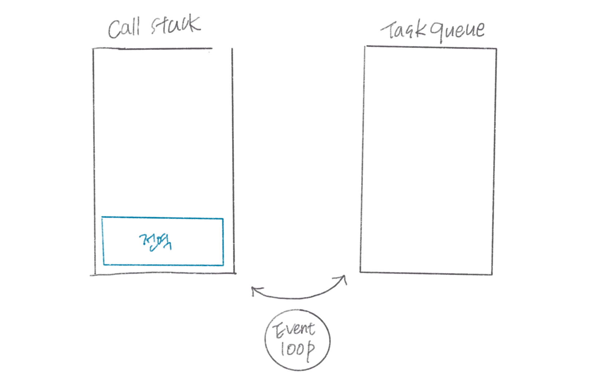
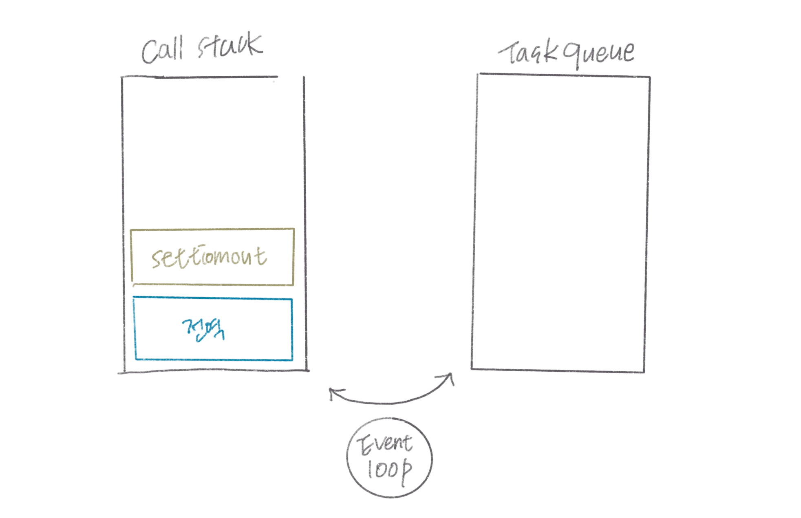
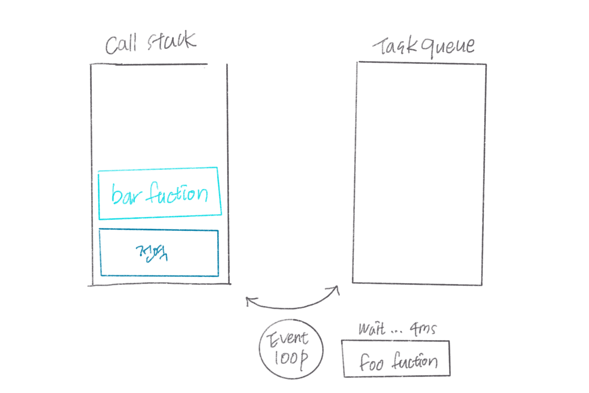
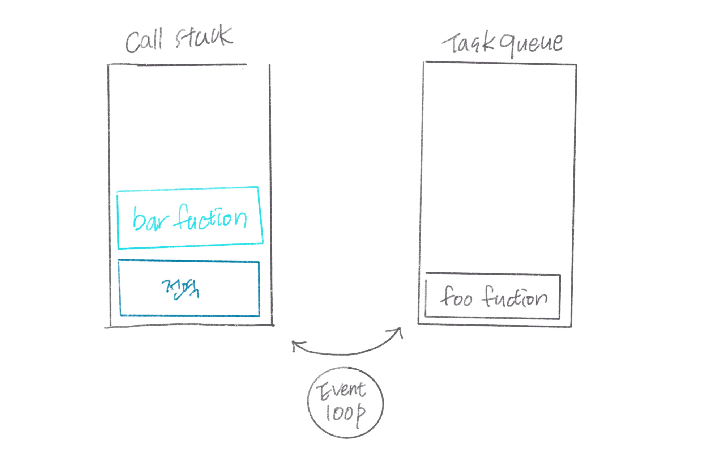
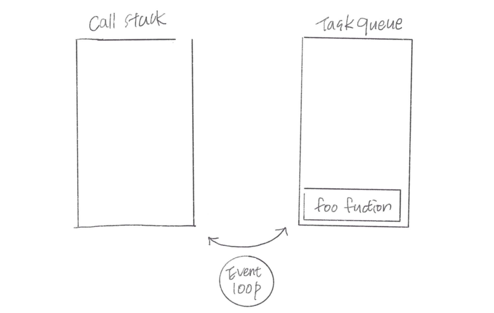
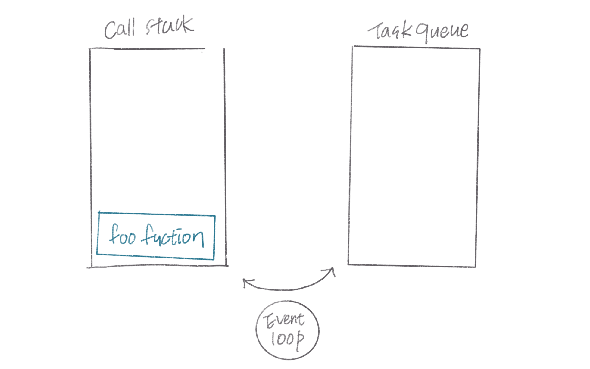

<span style="color:rgba(0,0,0,0)">자바스크립트는 싱글스레드라며? 어떻게 비동기 처리가 가능한 것일까?</span>

<!--more-->

<br/><br/><br/>

[모던 자바스크립트 deep dive](https://wikibook.co.kr/mjs/)를 스터디하면서 정리한 내용입니다.


<br/><br/>

# 동기 처리와 비동기 처리

자바스크립트는 싱글스레드로 동작한다. 즉, 자바스크립트 엔진은 단 하나의 실행 컨텍스트 스택을 갖기 때문에 두 가지 이상의 태스크를 동시에 실행할 수 없다. 따라서 현재 실행 중인 실행 컨텍스트를 제외한 컨텍스트는 모두 실행 대기중인 테스크들이다.
<br/>

> 그런데 이상한 점은.....자바스크립트로 개발하다보면 다른 함수가 동시에 실행되는데....이건 뭐람?

<br/>

## 1. 동기

싱글 스레드 방식은 한 번에 하나의 태스크만 실행할 수 있기 때문에 처리에 시간이 걸리는 태스크를 실행하는 경우 블로킹<sup>blocking:작업 중단</sup>이 발생한다.
이렇게 현재 실행 중인 태스크가 종료할 때까지 다음에 실행될 태스크가 대기하는 방식을 **동기 처리**라고 한다. <span class="bg_highlight">
동기 처리 방식은 태스크를 순서대로 하나씩 처리하므로 실행 순서가 보장된다는 장점이 있지만, 앞 태스크가 종료할 때까지 아휴 태스크들이 블로킹되는 단점이 있다.
</span>

<!-- 그림 첨부 42-2-->

<br/><br/>

## 2. 비동기

`setTimeout` 함수는 자신의 다음 코드를 블로킹하지 않는다. 따라서 `setTimeout`의 코드가 종료되지 않았어도 다음 코드는 실행된다. 이처럼 현재 실행 중인 태스크가 종료되지 않은 상태라 해도 다음 테스크를 곧바로 실행하는 방식을 **비동기 처리**라고 한다.

<!-- 그림 첨부 42-3-->

다만,<span class="bg_highlight"> 비동기 처리 방식은 블로킹이 발생하지 않는 다는 장점이 있지만, 태스크의 실행 순서가 보장되지 않는 단점이 있다.</span>
<br/><br/>
비동기로 방식하는 함수로는 타이머 함수인 `setTimeout`, `setInterval`, `HTTP 요청`, `이벤트 핸들러`가 있다. 어떻게 싱글스레드인 자바스크립트에서 비동기로 처리되는 함수가 있는 것일까?

<br/><br/>

# 이벤트 루프와 태스크 큐

자바스크립트의 비동기 처리를 지원하는 것은 바로 **이벤트 루프**이다. 이벤트 루프는 브라우저에 내장되어 있는 기능이다.

<!-- 그림 첨부 42-4-->

위 그림에서 처럼 자바스크립트 안에는 `콜 스택`이라는 영역이 있고, 소스코드가 실행되면서 함수를 호출하면 `콜 스택`에 순차적으로 푸시되고, 먼저 푸시된 순서대로 실행되고 콜 스택에서 사라진다. 결국 자바스크립트 엔진은 단순히 태스크가 요청되면` 콜 스택`을 통해 요청된 작업을 순차적으로 실행할 뿐이다. 비동기 처리에서 소스코드의 평가와 실행을 제외한 모든 처리는 자바스크립트 엔진을 구동하는 환경인 `브라우저` or `Node.js`가 담당한다.
<br/><br/>
예를 들어 보자. `setTimeout`의 콜백 함수의 평가와 실행은 자바스크립트 엔진이 담당하지만 호출 스케줄링을 위한 타이머 설정과 콜백 함수 등록은 `브라우저` or `Node.js`가 담당한다. 이를 위해 브라우저 환경은 **태스트 큐**와 **이벤트 루프**를 제공한다.

<br/>

> `태스크 큐 : task queue`<br/>
> 비동기 함수의 콜백 함수 또는 이벤트 핸들러가 일시적으로 보관되는 영역이다.<br/><br/> `이벤트 루프 : event loop`<br/>
> 이벤트 루프는 콜 스택에 현 재 실행 중인 실행 컨텍스트가 있는지, 태스크 큐에 대기 중인 함수가 있는지 반복해서 확인한다. 만약 콜 스택이 비어 있고 태스크 큐에 대기 중인 함수가 있다면 이벤트 루프는 순차적으로 함수를 태스크 큐에서 콜 스택으로 이동시키고, 콜 스택으로 이동된 함수는 실행된다.<br/>

<br/><br/>

```javascript
function foo() {
  console.log("foo");
}

function bar() {
  console.log("bar");
}

setTimeout(foo, 0);
bar();
```

위 코드에서 `setTimeout`에서 delay는 0초이다. 0초라도 실제로는 4ms 이후에 콜백함수 foo가 실행되는데, `foo` 함수와 `bar` 함수 중 어느 함수가 먼저 실행될까? 결과는 `bar` 함수 이후 `foo` 함수가 실행된다. 왜 그런지 아래에서 실행 순서를 그림으로 확인해보자.

<br/>


_전역 함수 실행_


_setTimeout 함수 실행_


_foo 함수 delay 대기, setTimeout 종료, bar 함수 실행_


_이벤트 루프에 의해 foo 함수 태스크 큐로 올라감_


_bar 함수, 전역 함수 실행 종료(call stack 빔)_


_foo 함수 실행 후 종료_
