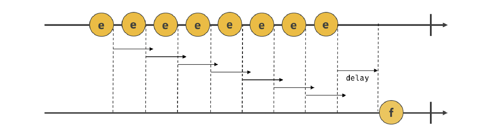
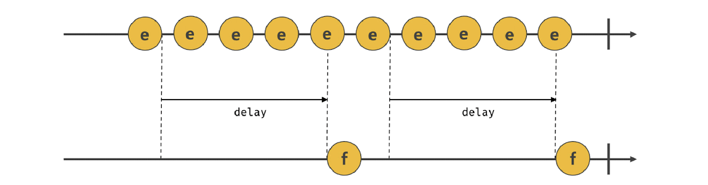

<span style="color:rgba(0,0,0,0)">함수 호출을 딜레이시키는 방법은 없을까?</span>

<!--more-->

<br/><br/><br/>

# 호출 스케줄링

- 함수를 명시적으로 호출하지 않고 일정 시간이 경과된 이후에 호출되도록 함수 호출을 예약하는 것을 호출 스케줄링이라고 한다. 호출 스케줄링을 하기 위해서는 타이머 함수를 사용한다.

- 타이머를 생성할 수 있는 타이머 함수 `setTimeout`과 `setInterval`, 타이머를 제거할 수 있는 clearTimeout과 clearInterval이 자바스크립트에서 제공되며, 타이머 함수는 빌트인 함수가 아닌 브라우저 환경과 node.js환경에서 제공하는 호스트 객체이다.

- 자바스크립트 엔진은 싱글 스레드로 동작한다. 이런 이유로 타이머 함수는 비동기 처리 방식으로 동작한다.

# 타이머 함수

## 1. setTimeout / clearTimeout

setTimeout 함수의 콜백 함수는 두 번째 인수로 전달받은 시간 이후 단 한 번 실행된다.

```javascript
const timeoutId = setTimeout(func[,delay, param1, param2,...]);
```

- func: delay 이후에 호출할 함수 코드
- delay: delay 시킬 시간 ms 기준
- param1, praram2 ... : func 함수에 전달할 인수

```javascript
// 1초(1000ms) 후 타이머가 만료되면 콜백 함수가 호출된다.
setTimeout(() => console.log("Hi!"), 1000);

// 1초(1000ms) 후 타이머가 만료되면 콜백 함수가 호출된다.
// 이때 콜백 함수에 'Lee'가 인수로 전달된다.
setTimeout((name) => console.log(`Hi! ${name}.`), 1000, "Lee");
```

<br/>

`setTimeout` 함수는 생성된 타이머를 식별할 수 있는 고유한 타이머 id를 반환한다. 이 id를 `clearTimeout` 함수의 인수로 전달하여 아직 delay가 만료되지 않은 발생 예정인 `setTimeout` 함수를 취소시킬 수 있다.

```javascript
// 1초(1000ms) 후 타이머가 만료되면 콜백 함수가 호출된다.
// setTimeout 함수는 생성된 타이머를 식별할 수 있는 고유한 타이머 id를 반환한다.
const timerId = setTimeout(() => console.log("Hi!"), 1000);

clearTimeout(timerId);
```

## 2. setInterval / clearInterval

`setInterval` 함수는 두 번째 인수로 전달받은 시간마다 반족 동작하는 타이머를 생성한다. 이는 타이머가 `clearInterval로` 취소될 때까지 반복된다.

```javascript
const timeoutId = setInterval(func[,delay, param1, param2,...]);
```

<br/>

`setInterval` 함수는 `setTimeout`과 마찬가지로 고유한 타이머 id를 반환하고, 이 id를 `clearInterval`에 인수로 전달하여 `setInterval` 호출 스케줄링을 취소할 수 있다.

```javascript
let count = 1;

// 1초(1000ms) 후 타이머가 만료될 때마다 콜백 함수가 호출된다.
const timeoutId = setInterval(() => {
  console.log(count); // 1 2 3 4 5

  if (count++ === 5) clearInterval(timeoutId);
}, 1000);
```

> 주의! <br/>
> 타이머 함수들의 delay 시간이 설정된 타이머가 만료되면 콜백 함수가 즉시 호출되는 것을 보장하지 않는다. `delay` 시간은 태스크 큐에 콜백 함수를 등록하는 시간을 지연시키는 것일 뿐이다.

## 3. debounce 와 throttle

scroll, resize, input, mousemove 같은 이벤트는 짧은 시간 가격으로 연속해서 발생한다. 만약 해당 이벤트에 바인딩한 이벤트 핸들러가 있다면 과하게 호출되어 성능에 문제가 발생할 수 있다.

`debounce`와 `throttle`은 타이머 함수를 기반으로 만들어진 프로그래밍 기법으로, 짧은 시간 간격으로 연속해서 발생하는 이벤트를 그룹화해서 과도한 이벤트 핸들러의 호출을 방지한다.

`debounce`와 `throttle`에 대해서는 간략하게 소개하고 넘어가고, 나중에 `lodash`나 `underscore`에서 제공하는 `debounce`와 `throttle`와 함께 자세한 예시를 들어 설명하는 포스팅을 하도록 하겠다.

### 3-1. debounce

`debounce`는 짧은 시간 간격으로 발생하는 이벤트를 그룹화해서 마지막에 한 번만 이벤트 핸들러가 호출되도록 한다.

```javascript
debounce(func, delay);
```

`debounce` 함수가 반환한 함수는 `debounce` 함수에 두 번째 인수로 전달한 시간보다 짧은 간격으로 이벤트가 발생하면 이전 타이머를 취소하고 새로운 타이머를 재설정한다. delay보다 짧은 간격으로 이벤트가 연속해서 발생하면 `debounce` 함수의 첫 번째 인수로 전달한 콜백 함수는 호출되지 않다가 delay동안 이벤트가 발셍하지 않으면 한 번만 호출된다.



### 3-2. throttle

`throttle`은 짧은 시간 간격으로 연속해서 발생하는 이벤트를 그룹화해서 일정 시간 단위로 이벤트 핸들러가 호출되도록 호출 주기를 만든다.

```javascript
throttle(func, delay);
```



`throttle`은 scroll 이벤트 처리나 무한 스크롤 UI를 구현 등에 유용하게 사용된다.

### Reference

> [모던 자바스크립트 deep dive](https://wikibook.co.kr/mjs/) <br/> [MDN SetTimeout](https://developer.mozilla.org/ko/docs/Web/API/setTimeout)
