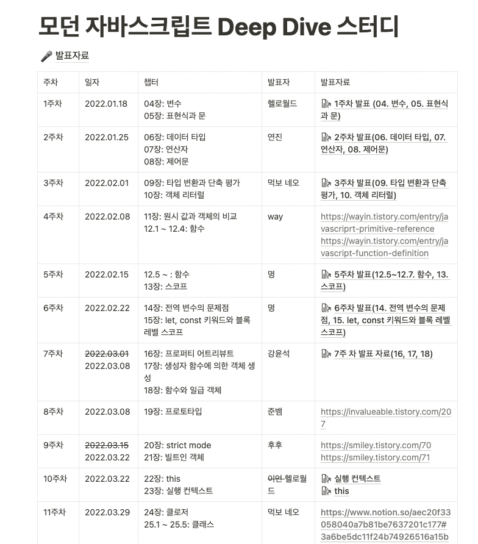

이걸 다 읽은 내가 자랑스러워...

<!--more-->

   

# 갑자기 책으로 개발 공부하고 싶어졌다.

사실 자바스크립트 공부는 개발자를 준비하면서부터 했기 때문에, 이전에도 원론적인 자바스크립트 공부는 많이 했었다. 매체도 다양했다. 인강, 유튜브, 학원 강의 등등....
 
사실 책으로 개발 공부를 하는걸 선호하는 편이 아니다. 공식 문서나 예제 코드를 보고 바로바로 만들어보고 습득하는 것을 좋아하는 편이다. 개발 공부를 처음 시작해서 2022년 초까지 약 2년 동안 읽은 개발 관련 서적이 1권이 채 안될 정도이니 말 다했다.
  
개발자로 현업에서 `javascript`와 `typescript`를 주 언어로 폭풍 개발을 하고 있는 8개월차 쯤, 그래도 처음보단 정말 많이 늘었다고 생각을 했다. 하지만 가끔 사수님의 설명과 함께 등장하는 원론적인 단어(스코프, 호이스팅, 클래스, 등등...)에 대해 정말 내가 잘 알고있는 걸까? 라는 의문이 생겼다.

**그래서 이것 저것 들추는거 말고 끝이 정해져 있는(한 바퀴 돌았다고 말할 수 있는) 책으로 자바스크립트를 다시 공부하기로 결심했다.**

## 1. 책 추천을 받다.

자바스크립트 책 추천을 검색하면... 책 말고 mdn으로 공부하라는 얘기, 클론 코딩하라는 얘기, 등등 책으로 공부하지 말라는 얘기가 많았지만, 걔 중 자주 추천 언급이 되는 책이 이 [모던 자바스크립트 딥다이브](https://wikibook.co.kr/mjs/)였다. 심지어 내가 좋아하는 인프런의 지식 공유자인 `정재남`님이 인프런에서 무료로 [스터디 강의](https://www.inflearn.com/course/%EB%AA%A8%EB%8D%98-%EC%9E%90%EB%B0%94%EC%8A%A4%ED%81%AC%EB%A6%BD%ED%8A%B8-%EB%94%A5%EB%8B%A4%EC%9D%B4%EB%B8%8C)도 찍어 놓으셨더라, 그래서 책 정보를 찾아보니...
  

 

👥👤👥👤뭐야...👤👤👥👥👥웅👥성👥👥👤거의 1000 페이지야....👤👥👤👤...(웅성웅성)👤👥👥👤...(웅)(성)👥👥👤👤👥👤👥👥👤..전공책보다 더 두꺼워....👤👥👥👤👥👤(수군)...👥👤👥수군...👤👥👤👥👤웅성...👥👤👤👥👥👤👥👤

  
**아...이거 내가 끝까지 읽을수 있을까?**

## 2. 본인이 의지로운 사람일 필요는 없다.

대신 없던 의지도 만들수 밖에 없는(?) 환경을 조성해야 한다.
  
난 보통 의지를 돈으로 사는 편이다 ㅎ.... 예를 들어 운동에 큰 돈을 주고 회원권을 끊어서 안 갈수 없게 만들어버리는 그런 방법...
물론 이 책을 다 읽는 의지를 돈 주고 살 방법은 없으니, 난생 처음으로 스터디를 들었다. 10명의 사람들이 각자 할당된 분량의 책을 읽고, 그 주차에 발표자가 내용을 요약해서 발표하고 서로 질문을 하는 스터디였다.
참고로 내가 스터디를 주로 구하는 사이트는 [인프런](https://www.inflearn.com/community/studies)이다.

 
이런 식으로 계획표가 미리 정해져있었고, 각자 자발적으로 원하는 주차를 나눠서 선택했다. 한 주의 분량이 적지 않음에도 워낙 양이 방대하다보니, 1월18일부터 시작했던 스터디가 5월31일까지 진행되었다. 생각보다 난이도도 있었기 때문에 중도 포기하는 사람도 3명이나 있었고, 그 사람들이 원래 맡기로 했던 파트를 다른 사람들이 맡아서 해야했다(그게 바로 나). 그래도 7명의 멤버들은 힘들어도 꿋꿋이 열심히 했다.

## 3. 그래서 스터디 추천해?

솔직히 발표 주차가 아닌 사람들도 해당 범위를 블로그나 노션에 정리해서 올려야 했으므로 책 난이도를 떠나서 생각보다 시간을 많이 투자를 해야했다. 일주일에 최소 6~8시간은 투자했다. 당시에 회사 일도 바쁘고 방송대 3학년을 다니고 있었고, 다른 스터디도 참여하고 있던게 있어서 정말 눈물을 흘리면서 스터디를 했던 것 같다 ㅋㅋㅋㅋㅋㅋ...😂 멤버들이 없었다면 정말 끝까지 할수있었을지 의문이다.  
**다른 책도 스터디를 추천하겠냐면은 확답하기 어렵지만, 의지가 박약하고 아직 자바스크립트가 낯선 사람에게는 이 책에 한해서는 스터디를 추천한다.**
사실 블로그 정리만 없었어도 시간을 절반 이상 아꼈을것 같지만, 블로그에 글로 정리를 해서 스터디 끝나고 남는 것도 있었고, 블로그 정리 전에 한번 읽고, 정리하면서 읽고, 모이는 날 다시 한번 정리한 부분을 읽게 되서 **강제적 반복**을 할 수 있어서 스터디 이후에도 남는게 많았다.  
또한 **자바스크립트는 생각보다 사람들과 얘기해볼 것이 많은 언어이다.** 스터디 발표 후 사람들과 해당 주제에 대해서 다른 자료를 함께 보거나, 해당 파트가 어려웠던 사람들의 질문에 대답해주면서 더 깊은 공부를 할 수 있었다. 그런면에서 혼자 공부하는 것보다 스터디를 하는 것이 장점이 될 수 있다.
  
다만, 스터디원을 구성할때 코딩이 처음이면서, 자바스크립트가 하필 그 첫 언어인 입문자 수준의 사람은 추천하지 않는다(이 책 자체를 추천하지 않는다). 지금 돌이켜보니 중도 하차하신 분들은 다른 언어에 대한 경험도 없고, 자바스크립트에 대한 친숙도가 낮은 분들이었던 것 같다. 사실 스터디 자체가 구성원들의 편차가 너무 심하면 제대로 진행되기 어렵다.

## 4. 결론적으로 책이 어떻다는 건데?

솔직히 정말 좋았다. 내용도 자세하고 깊이도 있었으며, 예제 코드는 매우 상세하다(심지어 예제 코드가 깃헙에 올라가 있다). 자바스크립트를 사용하면서 가졌던 의문을 빠짐없이 해결해주는 책이었다. `정재남`님이 여러번 읽으라고 하신 이유를 알겠더라.
  
책을 거의 다 읽었을 때쯤에는, 실제 개발에서도 변화가 있다고 느꼈다. 코드를 왜 이렇게 작성해야하는지 알고 작성하는 느낌이었달까? 그전에는 '많이들 이런 식으로 쓰던데? 에러나면 수정하고.'라는 느낌이었다. 즉, 자바스크립트의 중요한 개념인 호이스팅이나, 이벤트 루프, 비동기, 스코프를 대충 이론적으로는 알고 있지만, 실제 코드와 개념을 연관지어 작성하지 못했는데, 확실히 왜 이렇게 작성해야하고, 그렇지 않으면 뭐가 문제고를 명확히 알고 코딩을 할수 있게 됬다.
 

**아마 2022년에 가장 잘한 일 중에 하나가 이 책을 다 읽은 것일 것이다.**

사실 비전공자 출신 개발자이기 때문에 항상 개발 공부, CS공부를 하고있는데, 분량이 분량이니 만큼 가장 얻어가는 것도 많았던 책이었다. 이후에 사수님이 얘기하는 자바스크립트 이야기에는 막힘 없이(?) 이해하고 얘기할 수 있게 되었다. 자바스크립트 개발자라면 한번쯤은 꼭 읽어보라고 추천하고 싶다.
  
하지만, 자바스크립트로 프로그래밍을 처음 입문하는 사람에게 이 책은 읽는 다는 것은 프로그래밍을 포기하게 되는 벽이 될것 같다고 느꼈다. 난 이 책을 읽기 전 취업 전 공부 기간까지 합하면 1년 이상 자바스크립트를 사용해본 채로 이 책을 읽었고, 호이스팅, 스코프, 렉시컬 환경, 프로토타입, 이벤트 루프와 같은 유명한 자바스크립트의 개념을 이미 한번 이상 공부해봤거나, 어렴풋이 알고있었기 때문에 어렵지 않게 읽었지만, 프로그래밍 시작을 책으로 하길 원하는 사람이 이 책을 읽는다? 울면서 읽을 수도 있다 ㅎ....
실제로 자바스크립트를 써보면서 에러나 어려움을 겪었던 사람들은 이 책을 읽으면서 '이래서 그런거구만!'할 포인트가 많지만, 그런 경험이 없는 사람들은 책에서 읽어봤자 아무 공감도, 이해도 하기 어려울 것이다.
  
딥다이브 외에도 무언가 따라 만들어보는 자바스크립트 책이 아닌 개념적인 것 위주의 책은 입문자에게는 추천하기 어렵다. 굳이 '난 성향이 개념부터 한번 싹다 훑고, 문법도 한번 다 훑어야 직성이 풀리는 공부 스타일이야!'라고 한다면 이 책 말고 더 얇고 딥다이브의 간소화 버전 같은 [다른 책](https://wikibook.co.kr/corejs/)을 추천한다. 아니면 `정재남`님의 [인프런 강의](https://www.inflearn.com/course/%ED%95%B5%EC%8B%AC%EA%B0%9C%EB%85%90-javascript-flow#curriculum)를 들어보고, 책을 읽는 것이 딥다이브 책을 이해는데 도움이 될 수 있다.( 참고로 난 책은 반만 읽었고, 강의는 다 봤다.) 아니면 무료 스터디 강의라도 참고하자!

현재 티스토리 블로그를 깃헙 블로그로 이사하면서 블로그 정리 내용을 한번 씩 다시 훑으면서 깃헙 블로그에 정리하고 있어서, 다시 한번 읽고 있는데 두 번째 읽을 때도 첫번째와는 다른 새로운 배움이 있다! 정말 여러번 반복해서 읽기에도 좋은 책인 것 같다. 어쩌다보니 재남님 홍보만 많이 한것 같긴한데 ㅎ.... 결론적으로는 딥다이브 책을 추천하는 글임을 분명히 밝히는 바이다.😍

### feat.

책의 대략적인 수준이나 난이도는 제 블로그에 간단히 정리된 내용을 보거나(책은 중반부 부터 난이도가 올라간다.), 딥다이브의 저자이신 `이웅모`님의 [개발 튜토리얼 사이트](https://poiemaweb.com/)를 참고해보는 것이 더 좋을 것 같아 현재 리뷰 글에는 싣지 않았다.
