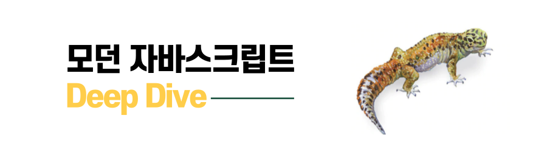
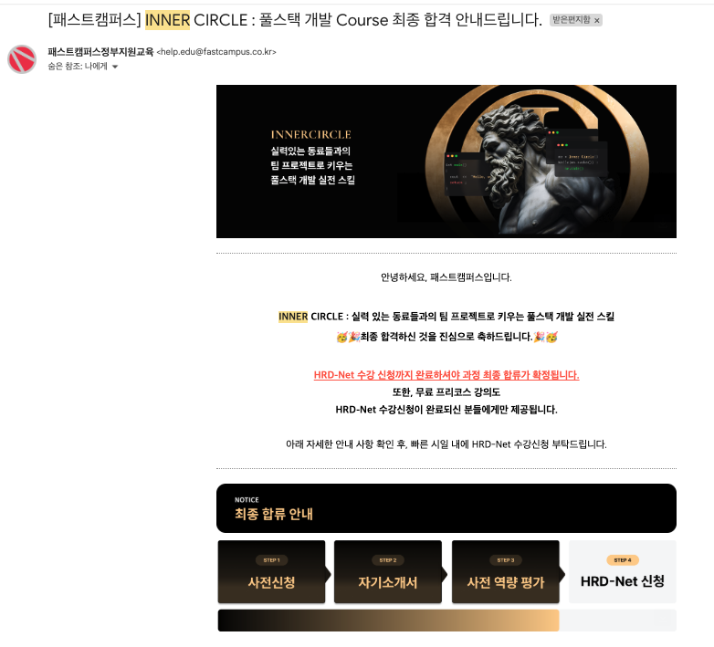
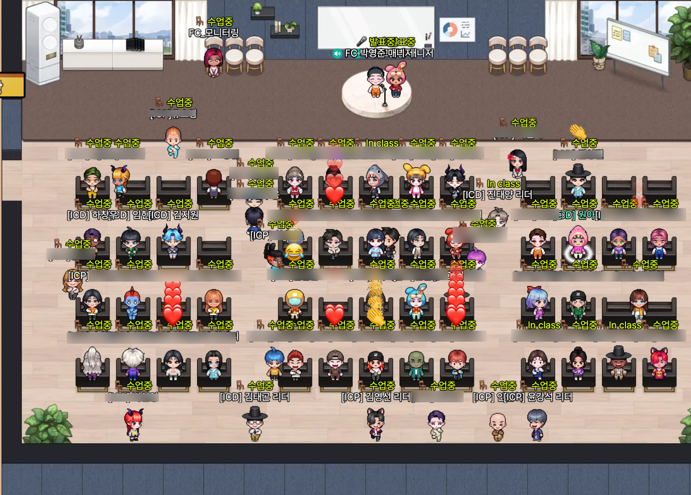

두구두구 이너서클 개봉박두!

<!--more-->

   

<!--  -->

# 재직자를 위한 개발자 교육이라니

6월, 개발자라는 직업에 대해 한창 고민이 많았던 시기에 인스타그램에서 우연히 '이너서클' 프로그램에 대한 광고를 보게 되었다.  
패스트캠퍼스에서 진행하는 것이라 단순히 신입 개발자가 되기 위한 부트캠프라고 생각했는데, 재직자를 위한 코스라는 것이다.  
 
40명 정원에 멘토를 김태곤, 진태양 개발자님이 진행하신다고 하여 관심이 갔다.  
내 스스로 개발자 커뮤니티나 네트워킹을 엄청 찾아다니는 수준은 아니라서 네임드(?) 유명한 개발자분들을 많이 알고 있지는 못했는데, 그럼에도 불구하고 알고 있던 분들이라 이분들에게 멘토링을 받으면 어떨까... 내가 가지고 있는 고민이나 걱정을 덜어낼 수 있는 시간이 될까? 라는 기대가 생겼다.  
 
내가 이너서클에 참여하게 된 더 자세한 계기나 상황은 추후에 다시 글을 작성하도록 하고, 여하튼 우연한 계기로 보게 되었던 그 광고로 난 이너서클에 지원하게 되었다.  
(지금 생각해보면 그때 내가 한창 개발자에 대해 고민이 많아 이리저리 정보를 찾아다녔는데, 마케팅 알고리즘의 타깃팅이 되어 노출되었으니 우연을 가장한 노림수가 아니었나...🤭)

# 삐빅 합격입니다.

몇 차례의 선발 과정을 거쳐  
10:1(오피셜)의 경쟁률을 뚫고(?) 합격하게 되었다.  
이너서클은 무려 4개월의 과정이다. 7월 20일부터 11월 9일에 끝난다. 무려 내 생일에 오프보딩 행사를 한다. 심지어 재직자 대상이란 것이 믿기지 않을 만큼 교육 시간이 길다.  
월/화/목 요일당 3시간, 토요일은 9시간, 총 1주에 18시간짜리 프로그램이다.

 합격하고도 고민이 많았다. 이걸 내가 일을 병행하면서 할 수 있을지... 심지어 방통대 수업도 함께 해야 했는데, 원래 같으면 이런 고민의 결정까지 다 하고 지원했겠지만, 이번에는 '에이 일단 합격하고! 되면 그때 가서 고민하자!'라고 생각하고 지원했다. 사실 그래서 시작한 지금도 걱정이 많다.  
 4년 차의 슬럼프인지, 절망의 협곡에 아직도 있는 건지는 모르겠지만, 스스로도, 주변에서도 나에게 어떠한 계기가 필요하다는 것을 알고 있었다. 울면서 하겠지만... 내 성격상 완주해낼 것이란 걸 나도 알고 있었다.

# 이너서클 개봉박두!

7월 20일 토요일. 이너서클 코스의 오리엔테이션이 진행되었다.  
오후 2시부터 9시까지였는데, 원래는 오리엔테이션은 오프라인으로 진행될 예정이었지만, 기상 악화 및 안전상의 이슈로 온라인으로 변경되었다.  
코스 소개나 진행 방식, 국비지원이기 때문에 출석 방식 소개 등 대체적으로 평이한 오리엔테이션이었다.  
다만 약 2시간의 행정적인 오리엔테이션 뒤에 개발 코스에 대한 자세한 오리엔테이션이 있을 것으로 생각했으나, 그게 아니었다.  
 
개발자 코스의 참여 인원은 총 40명, 프론트 20명, 백 20명이었다. 나는 프론트엔드 개발자 포지션으로 참여했고, 프론트엔드 멘토는 김태곤 개발자님이셨다.  
각자의 소개나 인사 없이, 팀 빌딩 전에 개발 실력 점검을 위한 프로젝트 과제가 주어졌다. 생각하지 못한 일이어서 당황했다.  
첫날에는 개발하는 것 없이 인사하고 소개하고 친목을 도모하는 수준이라고 생각했는데, 벙찐 느낌이었다.  
 

## 첫 번째 과제 스타트

과제는 Node.js를 사용하여 별도의 패키지 없이 커맨드라인으로 국가 기념일을 조회하는 애플리케이션 프로젝트였다. 구현 조건이나 사용해야 하는 조회 API가 주어졌고, 화면과 관련된 UI를 구현하는 개발은 아니었다.  
그렇다고 해도 사실 그렇게 어려운 과제는 아니었으나(검색과 GPT 사용 가능했으니) 아마 다른 사람들도 나처럼 첫날부터 개발을 할 것이라고는 예상 못해서 그런지 어버버한 느낌이었다.

내가 느끼기엔 생각보다 간단한 프로젝트인데, 우리가 시간이 너무 오래 걸려서 오히려 멘토님이 당황하시는 느낌이었다. (네... 서로 당황했습니다.)  
시간이 좀 지체되자 태곤님이 오늘 원래 2개의 프로젝트를 하려고 했으나, 1개는 숙제(?)로 내야겠다고 하셨고, 첫 번째 과제를 각자 풀리퀘를 올리는 순서대로 리뷰하는 시간을 가졌다.

최근에 업무를 하면서 타입스크립트 사용이 익숙했던 나는 타입스크립트로 세팅하여 개발을 진행하였고, 커맨드라인을 동일하게 맞추기 위해 시간이 좀 걸렸다. 20명 중에 꽤 뒷순서로 제출했던 것 같고, 제출한 뒤에도 다른 분들이 리뷰를 받는 동안 쫌쫌따리 수정을 계속했다.

## 코드 리뷰 시간

아무래도 경력자들의 모임이라서 그런지 구현을 못 하신 분은 없었고, 받는 피드백이 대체적으로 비슷했다.

- 사용하지 않는 참조 내역이나 콘솔, 주석은 제거할 것
- 트라이 캐치문의 범위가 너무 넓거나, 에러를 던지는 방법이 중복되는 경우가 많다는 것
- 함수나 변수의 이름이 의미적으로 많이 부족하다는 것

이 정도가 공통적인 피드백이었고, 중간중간 좋은 코드가 나오면 칭찬도 아끼지 않으셨다. 내가 받은 피드백으로는 다음과 같았다.

- 대체적으로 함수나 변수의 이름을 의미 있게 잘 작성하였으나, 영어적으로 틀린 표현이 있다는 점
- 필요한 모듈별로 스크립트 파일을 잘 분리한 것
- 들어온 데이터에 대해서 필요한 데이터로 가공하기 위한 파싱 함수를 잘 만들어 사용한 것
- 현재는 에러 메시지가 2개밖에 없어서 큰 문제가 없지만, 그래도 에러에 대한 추가 메시지를 작성하는 부분에서 확장성이 부족한 점(삼항 연산자를 사용하지 말고 함수로 빼는 방법)
- 데이터량이 작아서 반복문을 2번 돌아도 큰 문제는 없지만, 1번만에 끝내는 방법도 있으니 고려하면 좋겠는 점(map을 통해 데이터 가공하고 include로 확인하는 것이 아닌 some을 사용하는 방법)

와 같은 내용이 있었다. 중간에 왜 연도 타입을 `parseInt`로 한 번 돌렸기 때문에 `number`로 내보내도 됐는데, `toString`을 끝에 붙인 이유가 있는지 물어보셨다. 자신감 없이 "해당 값을 사용하는 함수를 먼저 작성했는데, 인자의 타입을 `string`으로 맞춰놨기 때문에, 그거에 맞춰 변형하느라 그랬다."라고 대답했다.   
멘토님이 그저 궁금해서 물어본 거고, 대답한 이유도 나쁘지 않은데, 앞으로 과정 중이든, 추후에 면접 자리에서든 자신감 있게 대답하라고 하셨다. 상대를 납득시킬 만한 이유가 있다면 문제 될 것이 전혀 없다고 하셨다. 과제를 하고 리뷰를 받으면서 긴장했는데 이야기를 듣고 자신감이 생겼다.

## 첫날의 소감은?

나보다 실력이 월등한 개발자분에게 코드 리뷰를 제대로 받는 것은 처음이었기 때문에, 사실 많이 긴장했던 것 같다.  
나도 사수가 있었지만, 우리 회사 사수분은 1년 차 정도까지만 일부 코드에 대한 리뷰나 개선점을 얘기해주셨고, 모두가 다 있는 곳에서 리뷰를 함께 한다기보다는 개인적으로 리뷰하는 형태였다.  
 어느 정도 내가 자기 몫의 개발을 할 수 있게 된 뒤 받는 제대로 된 첫 코드 리뷰였기 때문에 더 긴장했던 것 같다. 다른 회사에 다니는 개발자분들의 평균적인 실력 같은 것도 제대로 알지 못했기 때문에 내 개발이나 코드가 남들에게 어떻게 보일지 정말 가늠할 수 없었다.  
칭찬과 개선점을 함께 리뷰에서 듣고, '내가 많이 부족한 개발자는 아닐까, 우리 회사 밖에서는 내 실력이 4년 차에 비해 많이 부족하면 어쩌지' 내 마음에서 떠나지 않던 의문이 조금은 해소된 것 같았다. 처음 개발을 배우면서 즐겁고, 더 잘하고 싶다고 생각하던 마음과 기분이 되살아나는 것 같았다.

코스의 과정이 워낙 길고, 기울여야 하는 시간과 노력도 많아야 하는 만큼 걱정이 많았는데, 오히려 첫날의 과제를 마친 뒤에 코스를 더 열심히, 그리고 즐거운 마음으로 임해야겠다는 생각이 드는 하루였다.
