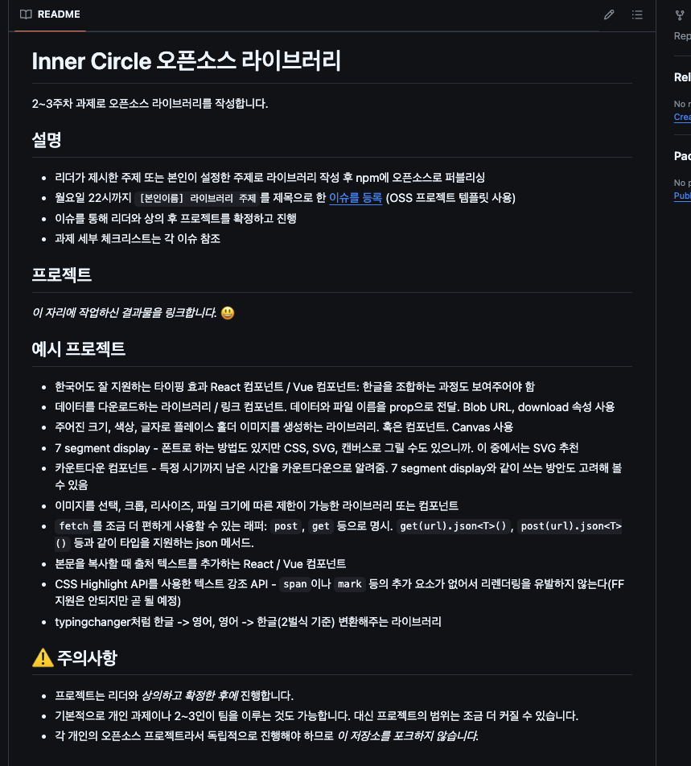
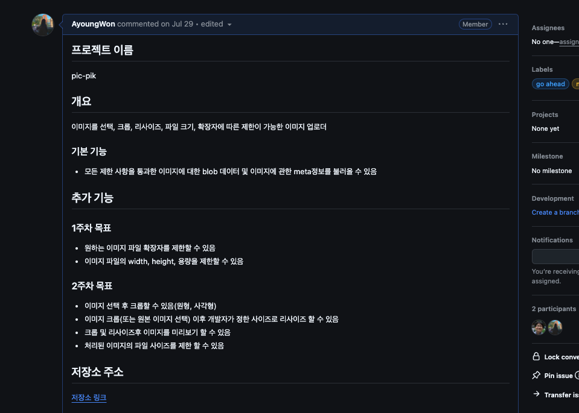
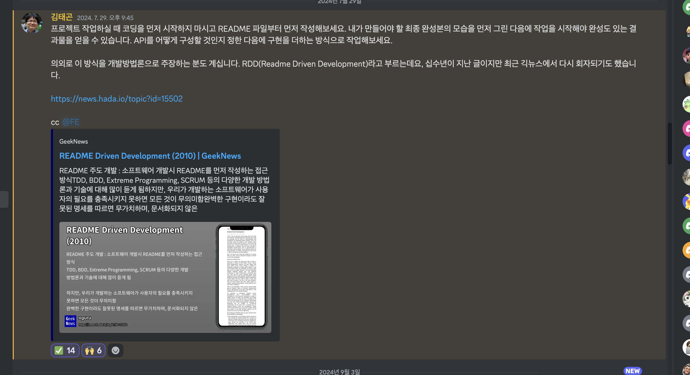
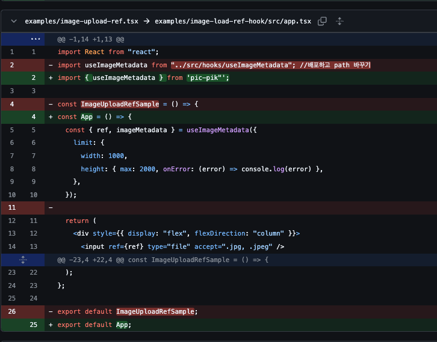
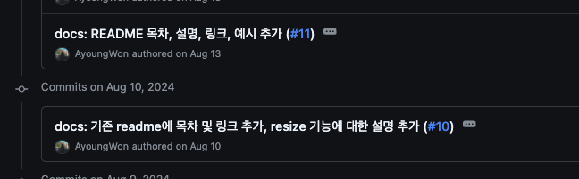

<span style="color:rgba(0,0,0,0)">드디어 나도 오픈 소스 개발자?!</span>

<!--more-->

<br/><br/><br/>

<!--  -->

# 세번째 프로젝트 시작하다

7월 27일까지 매주 1개씩 총 2번의 작은 과제를 진행했다. 첫날 과제와 두번째 바닐라JS로 자판기 만드는 프로젝트까지. 지금까지는 사실 워밍업 같은 과정이었다고 생각이 들었다.
이너써클이 어떤 식으로 돌아가는지 진행해보는 과정이랄까? 물론 그 안에서도 나는 많은 우여곡절이 있었고 또 그래서 많이 배웠다🥲

세번째 프로젝트는 무려 2주 넘게 진행하는 오픈소스 라이브러리 만들기 프로젝트다.

## OSS 프로젝트


오픈소스 프로젝트인데 왜 OS가 아니고 OSS인지 의아했다. 원래 오픈소스가 `Open Source Software`에 준말이라고 한다 ㅎㅎ..
주제는 멘토님이 여러개 주셨다. fetch 라이브러리, typing effect 라이브러리, 이미지 라이브러리, placeholder 라이브러리 등. 주신 주제 중에 골라도 되고, 본인이 하고싶은게 있으면 리더(멘토)님과 상의 후 진행하는 방식이다.
같은 주제인 경우 팀프로젝트로 진행해도 됬지만 역시 밋업이 없었어서 그런가 아직 덜 친해서 같은 주제인 사람들도 각자 도생했다(나중에 후회했더라는)


나는 이미지 관련 라이브러리를 만들기로했다. 실무에서 일할때마다 이미지 파일을 업로드하기 위해 input을 만들고 제한 사항에 따른 검증 로직을 만들고 하는 코드가 매번 있었기 때문에, 라이브러리로 만들어놓으면 실무에서도 활용할 수 있을것 같았다. 태곤님이 프론트에서도 이미지 파일을 리사이즈 할 수있으니 리사이즈 기능도 구현하라고 조언해주셨다.
참고로 요구 사항도 있었다. NPM에 배포할 것이니 만큼, 그에 준하는 README 작성과 테스트커버리지 60%로 이상 달성하는 것이 조건으로 붙었다.

## RDD(Readme Driven Development)


리드미 주도 개발.....?
이제 별의별 주도 개발이 있다고 생각했다. 근데 알고보니 RDD는 십수년이나 된 개발 방법론이였다🙄<br/>
개발을 시작하기전에 README에 기능명세나 완성된 프로젝트의 README라고 생각하고 먼저 작성해 본 뒤, 개발을 해보라는 것.
먼저 이런 작업을 함으로써 무엇을 해야할지 목표를 명확히 알게됨으로 쓸데없이 시간을 낭비하는 것을 줄이자는 개발 방법론.
우리같이 아직 많은 기능 설계나 명세서를 작성해본적이 없는 개발자에게는 특히나 중요하고 또 그만큼 힘들 것 같았다.

### 역시나가 역시나

첫줄부터가 정말 절망의 연속 ㅋ.....
무엇을 써야할지 모르니, 절망 그자체였다. 오랫만에 손깍지를 끼고 모니터만 빤히 쳐다봤다.
일단 예쁘게 적는건 포기하고, 내가 어떤 기능을 만들어줄지 크게 생각해봤다.

1. 이미지 파일을 읽어오는 input을 component로 제공할 것
2. 컴포넌트의 기능 중에 이미지에 대한 metadata를 조회할 수 있을 것
3. metadata를 읽는 기능을 hook으로도 제공할 것
4. 이미지 파일에 대한 제한을 둘 수 있는 기능을 추가할 것
5. 읽어온 이미지에 대해 resize해서 파일을 리턴해 줄 것

사실 이 5줄 쓰는데도 실제로는 오래걸렸다. 명확하게 문장으로 정의하려니 생각보다 쉽지 않았다. 하지만 이렇게 어느정도 확실하게 정의하고나니 개발 속도는 속도가 붙었다.
실제로 여러번 개발해본 기능이라서 metadata와 파일을 읽어오는 custom 컴포넌트를 label과 input을 활용해서 빠르게 만들었다.
custom hook을 만들기 위해 컴포넌트에서 만들어둔 기능을 hook으로 빼서 ref로 input을 연결하는 방식으로 개발했다.

### 산넘어 산이야 - 테스트 코드편

2주동안 개발할 예정이였으므로 일단 리사이즈 기능은 만들지 않고, 1주차 토요일에 피드백까지 받기 위해 컴포넌트와 hook에 대해 테스트 코드를 작성하려고 했다. 이전 프로젝트에서 vitest가 유틸리티 함수를 테스트 하기에 매우 간편했으므로, hook에서의 정보를 읽어오는 메인 로직을 테스트하려고 했다.
아직 테스트 코드 작성에 익숙하지 않았던 터라, input에 실제 이미지 파일을 붙여서 테스트 하는것은 쉽지 않았다. vitest로 커버리지 60%를 달성하려면 해당 기능에서 이미지 파일에 대한 데이터를 읽어드리기 위해 사용하고 있는 image 객체와 fileReader를 가짜로 모킹해서 load 함수도 빈 함수로 모킹하여 리턴 하는 데이터도 모킹한 데이터와 같은지 테스트하는 수밖에 없었는데, 힘들게 찾아보면서 다 작성하고 나니 이러면 실제로 만든 기능을 테스트하는 함수가 아니라는 고민에 휩쌓였다.(테스트를 위한 테스트 코드를 작성했다랄까....테스트 코드 커버리지 제한을 맞추기 위해 급급했다.)
일단 혼자 지지고 볶고 고민하는 사이, 1주일이 끝나버렸고, 피드백을 받았다.

## 1주차 피드백

내가 받은 피드백은 다음과 같다.

```md
### 1주차 피드백(개선필요사항)

- zero dependency로 만들기
- 프로퍼티의 이름 명시적으로 바꾸기
- examples형식을 온전한 프로젝트 형식으로 만들어주기
- readme에 프로퍼티에 대한 상세한 설명과 예시 추가, 타입 정의, 관련 내용에 링크 엮어주기
- E2E 테스트 추가하기
```

### 피드백 반영하기

**zero dependency로 만들기**<br/>
일단 사용하지 않아도 되는데, 필요할까봐 설치한 라이브러리를 모두 삭제했다.
예를 들면, input을 화면에서 숨기고 label로 핸들링 하게끔 만들어 놓은 상태였는데, 숨기는 style때문에 굳이 emotion을 사용하고 있었어서, 해당 부분을 inline style로 변경하고, 패키지를 삭제했다.
또한 react와 같은 라이브러리들은 사용자의 설치 패키지와 충돌을 할 수가 있어서, dependency에서 peerDependencies로 변경했다.
사실, peerDependencies에 대해서 직접적으로 고민해보거나 정의에 대해서 알아본 적이 없어서, 해당 내용을 공부해보게 되는 좋은 경험이 됬다👍🏻

**프로퍼티의 이름 명시적으로 바꾸기**<br/>
나름 readme를 먼저 작성하고 개발은 진행한 터라, 명시적이고 의미적으로 작성하려고 노력했는데, 그럼에도 불구하고 실수가 있거나. 더 발전시킬수 있는 이름들이 있었다.
예를 들어, 메인 기능의 이름을 `ImageUploader`라고 지었는데, 왠지 파일을 어딘가로 올리는 기능까지 포함하는 것 같아서, `ImageLoader`로 변경했다(파일 읽어들이는게 메인 기능이므로).
또한 제한 설정을 하는 옵션 프로퍼티를 `validateOptions`에서 `limit`으로 변경해서, 파일의 제한 사항을 지정하는 옵션임을 더 명확하게 했다.

**examples형식을 온전한 프로젝트 형식으로 만들어주기**<br/>
내가 작성한 examples는, 해당 소스 코드를 상대 경로로 불러와서 작성이 된 상태였는데, 태곤님께서 유저가 해당 파일을 그대로 복붙해서 사용하더라도 정상적으로 작동하는 예시 코드를 작성하라고 피드백을 해주셨다.
생각해보니 지금까지 내가 써왔던 라이브러리들의 예시 코드 파일은 그러한 형식이었다는 것을 깨닫고 나도 수정하기로 했다.

이제 문제는, 아직 배포하지 않은 코드를 어떻게 배포한 것처럼 `import`해와서 사용할 수 있을까? 라는 것이였는데,(아니면 로컬에서 에러나니까)
찾아보니 `npm link`를 사용하면, 로컬에서 작업 중인 패키지를 다른 프로젝트에서 의존성처럼 사용할 수 있도록 연결할 수 있다는 것을 알았고,
해당 부분을 적용해서 예시 코드를 수정했다.



<br/>**readme에 프로퍼티에 대한 상세한 설명과 예시 추가, 타입 정의, 관련 내용에 링크 엮어주기**<br/>
이건 사실, 피드백 받은거라기보단 나 혼자 그렇게 생각한 부분이다(실제로 자세히 쓴 편이라고 하셨음). 다른 좋은 라이브러리들을 보니 readme가 매우 자세하고, 링크 연결도 잘되있고, typescript를 지원하는 경우 type에 대한 상세한 부분까지 작성되어 있는 경우를 많이 보았다. 좋은 라이브러리란, 사용자가 보고 굳이 질문하지 않더라도 궁금한 점을 문서에서 읽고 바로 사용할 수 있는 라이브러리라고 생각하기 때문에, 나도 이부분을 반영했다.




<br/>**E2E 테스트 추가하기**<br/>
앞서 말한 것 처럼, 결국 내가 작성한 테스트 코드는, 실제 해당 함수나 기능이 잘 작동하는지를 검증한다기보다는, 테스트 코드를 위한 테스트를 작성한 수준에 머물러 있었다. 특히, Vitest만으로는 브라우저에서 동작하는 API를 사용할 수 없었기 때문에 더 그렇게 느껴졌다.

태곤님이 Cypress 등을 사용해서 실제 브라우저 환경 위에서 E2E 테스트를 진행해보라고 조언해 주셨다. 하지만 여러 가지 테스트 라이브러리를 혼합해서 사용하면 테스트 코드 커버리지 계산이 복잡하거나 불가능해질 수 있어서, 최대한 한 가지 툴로만 작업을 진행하고 싶었다. 그런데 Cypress의 E2E와 Component 테스트 기능을 각각 사용하면 코드 커버리지가 통합되지 않고 따로 계산되기 때문에, 이 부분도 고민이 많았다.

결론적으로는, E2E 테스트가 아닌 Cypress의 Component 테스트로 문제를 해결했다. 이유는 다음과 같다:

```md
- 코드 커버리지가 통합되었으면 좋겠다.
- 하나의 툴로 내가 필요한 모든 테스트를 진행할 수 있으면 좋겠다.
- 가볍게 돌아가는 테스트 툴이었으면 좋겠다.
- 다른 GUI 조작 필요없이, 커맨트로 실행되었으면 좋겠다.
```

위와 같은 이유가 있었고, 조언해주신 것처럼 E2E 테스트로도 내가 만든 훅이나 컴포넌트를 테스트할 수는 있었다. 하지만 지금까지 Cypress의 E2E 테스트를 사용했던 경험을 돌이켜보면, GUI 테스트를 포함하다 보니 Vitest나 Node 기반 테스트 러너보다 훨씬 더 무겁게 느껴졌다. 그리고 테스트 코드 작성 과정도 상대적으로 복잡했다. 예를 들어, 원하는 엘리먼트를 선택하기 위해 selector를 찾아야 하는 작업이 추가적으로 필요했기 때문이다.

반면, 내가 만든 라이브러리에서 제공하는 훅과 컴포넌트의 로직이 잘 동작하는지에 대한 테스트가 목표였으므로, 굳이 E2E 테스트를 사용할 필요는 없었다.

Cypress의 Component 테스트는 브라우저 환경 내에서 개별 컴포넌트를 격리된 상태로 진행되기 때문에, 브라우저에서 제공하는 API도 충분히 사용할 수 있었다. 게다가 테스트 실행도 더 가볍고, 내가 원하는 목적에 딱 맞았다.

또한, E2E 테스트는 브라우저를 띄우고 엘리먼트를 직접 선택하는 작업이 필요하지만, Component 테스트는 CLI 환경에서 실행할 수 있어 더 간편하다. 특히, 테스트 실행과 테스트 커버리지 산출을 하나의 명령어로 통합할 수 있어, 별도의 추가 작업 없이도 효율적인 테스트 환경을 구축할 수 있었다. (물론 E2E도 설정하면 가능하다)

```js
//테스트 코드 중 일부
import { type Limit } from "@pic-pik/core";
import LoadImage from "./LoadImage";

describe("useImage Hook - Image Metadata Test", () => {
  it("should upload an image and display its metadata", () => {
    // 컴포넌트를 마운트
    cy.mount(<LoadImage />);

    // 로컬 테스트 이미지를 설정
    const filePath = "images/danbi.jpeg"; // 실제 테스트 이미지 경로 설정

    cy.get('input[type="file"]').attachFile(filePath);

    // 메타데이터가 올바르게 표시되는지 확인
    cy.get("#metadata", { timeout: 10000 }).should("exist");
    cy.get("#width").should("contain", "Width: 217"); // 너비 정보 확인
    cy.get("#height").should("contain", "Height: 232"); // 높이 정보 확인
    cy.get("#size").should("contain", "Size: 7890"); // 파일 크기 확인
    cy.get("#name").should("contain", "Name: danbi.jpeg"); // 파일 이름 확인
    cy.get("#extension").should("contain", "Extension: jpeg"); // 파일 확장자 확인
  });

  it("should trigger onError when image width exceeds limit", () => {
    // onError 핸들러를 정의
    const onError = cy.stub();

    // width를 100으로 제한
    const limit: Limit = {
      width: { max: 100, onError },
    };

    cy.mount(<LoadImage limit={limit} />);

    const filePath = "images/danbi.jpeg";

    cy.get('input[type="file"]').attachFile(filePath);

    // onError 핸들러가 호출되었는지 확인
    cy.wrap(onError).should("have.been.calledOnce");

    // 메타데이터가 표시되지 않는지 확인
    cy.get("#metadata").should("not.exist");
  });
});
```

일단 여기까지가 오픈소스 프로젝트에 대한 첫번째 이야기이다. 이것 말고도 추가적으로 고민하고, 발전 시킨 부분에 대해서는 2편에서 이어서 이야기 해보도록 하겠다!😅
확실히 오픈소스다 보니, 여러모로 고민하고, 더 신경써야 하는 부분이 많다는 점...
