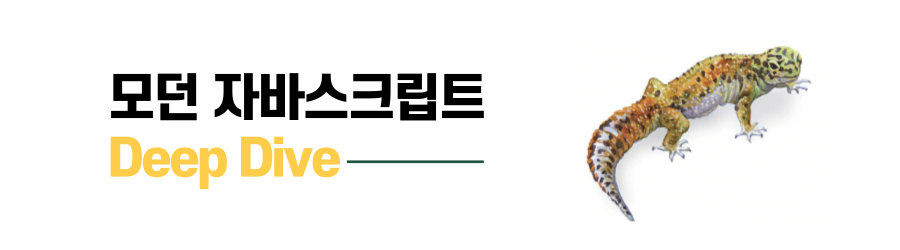

<span style="color:rgba(0,0,0,0)">드디어 나도 오픈 소스 개발자?!</span>

<!--more-->

<br/><br/><br/>

<!--  -->

# 세 번째 프로젝트 시작하다

7월 27일까지 매주 1개씩 총 2번의 작은 과제를 진행했다. 첫날 과제와 두 번째 바닐라JS로 자판기 만드는 프로젝트까지. 지금까지는 사실 워밍업 같은 과정이었다고 생각이 들었다.  
이너서클이 어떤 식으로 돌아가는지 진행해보는 과정이랄까? 물론 그 안에서도 나는 많은 우여곡절이 있었고 또 그래서 많이 배웠다. 🥲

세 번째 프로젝트는 무려 2주 넘게 진행하는 오픈 소스 라이브러리 만들기 프로젝트다.

## OSS 프로젝트

  
오픈 소스 프로젝트인데 왜 OS가 아니고 OSS인지 의아했다. 원래 오픈 소스가 `Open Source Software`의 준말이라고 한다. ㅎㅎ...  
주제는 멘토님이 여러 개 주셨다. `fetch` 라이브러리, `typing effect` 라이브러리, `이미지` 라이브러리, `placeholder` 라이브러리 등. 주신 주제 중에 골라도 되고, 본인이 하고 싶은 게 있으면 리더(멘토)님과 상의 후 진행하는 방식이다.  
같은 주제인 경우 팀 프로젝트로 진행해도 됐지만, 역시 밋업이 없었어서 그런가 아직 덜 친해서 같은 주제인 사람들도 각자 도생했다(나중에 후회했더라는).

  
나는 이미지 관련 라이브러리를 만들기로 했다. 실무에서 일할 때마다 이미지 파일을 업로드하기 위해 `input`을 만들고 제한 사항에 따른 검증 로직을 만들고 하는 코드가 매번 있었기 때문에, 라이브러리로 만들어놓으면 실무에서도 활용할 수 있을 것 같았다. 태곤님이 프론트에서도 이미지 파일을 리사이즈할 수 있으니 리사이즈 기능도 구현하라고 조언해 주셨다.  
참고로 요구 사항도 있었다. NPM에 배포할 것이니 만큼, 그에 준하는 README 작성과 테스트 커버리지 60% 이상 달성하는 것이 조건으로 붙었다.

## RDD(Readme Driven Development)

  
리드미 주도 개발.....?  
이제 별의별 주도 개발이 있다고 생각했다. 근데 알고 보니 RDD는 십수 년이나 된 개발 방법론이었다. 🙄  
개발을 시작하기 전에 README에 기능 명세나 완성된 프로젝트의 README라고 생각하고 먼저 작성해 본 뒤, 개발을 해보라는 것.  
먼저 이런 작업을 함으로써 무엇을 해야 할지 목표를 명확히 알게 됨으로 쓸데없이 시간을 낭비하는 것을 줄이자는 개발 방법론.  
우리같이 아직 많은 기능 설계나 명세서를 작성해 본 적이 없는 개발자에게는 특히나 중요하고 또 그만큼 힘들 것 같았다.

### 역시나가 역시나

첫 줄부터가 정말 절망의 연속 ㅋ.....  
무엇을 써야 할지 모르니, 절망 그 자체였다. 오랜만에 손깍지를 끼고 모니터만 빤히 쳐다봤다.  
일단 예쁘게 적는 건 포기하고, 내가 어떤 기능을 만들어줄지 크게 생각해봤다.

1. 이미지 파일을 읽어오는 `input`을 `component`로 제공할 것
2. `component`의 기능 중에 이미지에 대한 `metadata`를 조회할 수 있을 것
3. `metadata`를 읽는 기능을 `hook`으로도 제공할 것
4. 이미지 파일에 대한 제한을 둘 수 있는 기능을 추가할 것
5. 읽어온 이미지에 대해 `resize`해서 파일을 리턴해 줄 것

사실 이 5줄 쓰는 데도 실제로는 오래 걸렸다. 명확하게 문장으로 정의하려니 생각보다 쉽지 않았다. 하지만 이렇게 어느 정도 확실하게 정의하고 나니 개발 속도는 붙었다.  
실제로 여러 번 개발해본 기능이라서 `metadata`와 파일을 읽어오는 커스텀 `component`를 `label`과 `input`을 활용해서 빠르게 만들었다.  
커스텀 `hook`을 만들기 위해 `component`에서 만들어둔 기능을 `hook`으로 빼서 `ref`로 `input`을 연결하는 방식으로 개발했다.

### 산 넘어 산이야 - 테스트 코드 편

2주 동안 개발할 예정이었으므로 일단 리사이즈 기능은 만들지 않고, 1주 차 토요일에 피드백까지 받기 위해 `component`와 `hook`에 대해 테스트 코드를 작성하려고 했다.  
이전 프로젝트에서 `vitest`가 유틸리티 함수를 테스트하기에 매우 간편했으므로, `hook`에서의 정보를 읽어오는 메인 로직을 테스트하려고 했다.  
아직 테스트 코드 작성에 익숙하지 않았던 터라, `input`에 실제 이미지 파일을 붙여서 테스트하는 것은 쉽지 않았다.

`vitest`로 커버리지 60%를 달성하려면 해당 기능에서 이미지 파일에 대한 데이터를 읽어들이기 위해 사용하고 있는 `image` 객체와 `fileReader`를 가짜로 목킹(Mock)해서 `load` 함수도 빈 함수로 목킹하여 리턴하는 데이터도 목킹한 데이터와 같은지 테스트하는 수밖에 없었는데, 힘들게 찾아보면서 다 작성하고 나니 이러면 실제로 만든 기능을 테스트하는 함수가 아니라는 고민에 휩싸였다. (테스트를 위한 테스트 코드를 작성했다랄까....테스트 코드 커버리지 제한을 맞추기 위해 급급했다.)  
일단 혼자 지지고 볶고 고민하는 사이, 1주일이 끝나버렸고, 피드백을 받았다.

## 1주차 피드백

내가 받은 피드백은 다음과 같다.

```md
### 1주차 피드백(개선 필요 사항)

- zero dependency로 만들기
- 프로퍼티의 이름 명시적으로 바꾸기
- examples 형식을 온전한 프로젝트 형식으로 만들어주기
- README에 프로퍼티에 대한 상세한 설명과 예시 추가, 타입 정의, 관련 내용에 링크 엮어주기
- E2E 테스트 추가하기
```

### 피드백 반영하기

**zero dependency로 만들기**  
일단 사용하지 않아도 되는데, 필요할까 봐 설치한 라이브러리를 모두 삭제했다.  
예를 들면, `input`을 화면에서 숨기고 `label`로 핸들링 하게끔 만들어 놓은 상태였는데, 숨기는 `style` 때문에 굳이 `emotion`을 사용하고 있었어서, 해당 부분을 `inline style`로 변경하고, 패키지를 삭제했다.  
또한 `react`와 같은 라이브러리들은 사용자의 설치 패키지와 충돌할 수 있어서, `dependency`에서 `peerDependencies`로 변경했다.  
사실, `peerDependencies`에 대해서 직접적으로 고민해보거나 정의에 대해 알아본 적이 없어서, 해당 내용을 공부해보게 되는 좋은 경험이 됐다. 👍🏻

**프로퍼티의 이름 명시적으로 바꾸기**  
나름 README를 먼저 작성하고 개발을 진행한 터라, 명시적이고 의미적으로 작성하려고 노력했는데, 그럼에도 불구하고 실수가 있거나 더 발전시킬 수 있는 이름들이 있었다.  
예를 들어, 메인 기능의 이름을 `ImageUploader`라고 지었는데, 왠지 파일을 어딘가로 올리는 기능까지 포함하는 것 같아서, `ImageLoader`로 변경했다(파일 읽어들이는 게 메인 기능이므로).  
또한 제한 설정을 하는 옵션 프로퍼티를 `validateOptions`에서 `limit`으로 변경해서, 파일의 제한 사항을 지정하는 옵션임을 더 명확하게 했다.

**examples 형식을 온전한 프로젝트 형식으로 만들어주기**  
내가 작성한 `examples`는, 해당 소스 코드를 상대 경로로 불러와서 작성된 상태였는데, 태곤님께서 유저가 해당 파일을 그대로 복붙해서 사용하더라도 정상적으로 작동하는 예시 코드를 작성하라고 피드백을 해주셨다.  
생각해보니 지금까지 내가 써왔던 라이브러리들의 예시 코드 파일은 그러한 형식이었다는 것을 깨닫고 나도 수정하기로 했다.

이제 문제는, 아직 배포하지 않은 코드를 어떻게 배포한 것처럼 `import`해와서 사용할 수 있을까?라는 것이었는데,(아니면 로컬에서 에러 나니까)  
찾아보니 `npm link`를 사용하면, 로컬에서 작업 중인 패키지를 다른 프로젝트에서 의존성처럼 사용할 수 있도록 연결할 수 있다는 것을 알았고, 해당 부분을 적용해서 예시 코드를 수정했다.


**README에 프로퍼티에 대한 상세한 설명과 예시 추가, 타입 정의, 관련 내용에 링크 엮어주기**  
이건 사실, 피드백받은 거라기보단 나 혼자 그렇게 생각한 부분이다(실제로 자세히 쓴 편이라고 하셨음).  
다른 좋은 라이브러리들을 보니 README가 매우 자세하고, 링크 연결도 잘 되어 있고, `TypeScript`를 지원하는 경우 타입에 대한 상세한 부분까지 작성되어 있는 경우를 많이 보았다.  
좋은 라이브러리란, 사용자가 보고 굳이 질문하지 않더라도 궁금한 점을 문서에서 읽고 바로 사용할 수 있는 라이브러리라고 생각하기 때문에, 나도 이 부분을 반영했다.

  


**E2E 테스트 추가하기**  
앞서 말한 것처럼, 결국 내가 작성한 테스트 코드는, 실제 해당 함수나 기능이 잘 작동하는지를 검증한다기보다는, 테스트 코드를 위한 테스트를 작성한 수준에 머물러 있었다.  
특히, `Vitest`만으로는 브라우저에서 동작하는 API를 사용할 수 없었기 때문에 더 그렇게 느껴졌다.

태곤님이 `Cypress` 등을 사용해서 실제 브라우저 환경 위에서 E2E 테스트를 진행해보라고 조언해 주셨다.  
하지만 여러 가지 테스트 라이브러리를 혼합해서 사용하면 테스트 코드 커버리지 계산이 복잡하거나 불가능해질 수 있어서, 최대한 한 가지 툴로만 작업을 진행하고 싶었다.  
그런데 `Cypress`의 E2E와 Component 테스트 기능을 각각 사용하면 코드 커버리지가 통합되지 않고 따로 계산되기 때문에, 이 부분도 고민이 많았다.

결론적으로는, E2E 테스트가 아닌 `Cypress`의 Component 테스트로 문제를 해결했다. 이유는 다음과 같다:

```md
- 코드 커버리지가 통합되었으면 좋겠다.
- 하나의 툴로 내가 필요한 모든 테스트를 진행할 수 있으면 좋겠다.
- 가볍게 돌아가는 테스트 툴이었으면 좋겠다.
- 다른 GUI 조작 없이, 커맨드로 실행되었으면 좋겠다.
```

위와 같은 이유가 있었고, 조언해주신 것처럼 E2E 테스트로도 내가 만든 `hook`이나 `component`를 테스트할 수는 있었다.  
하지만 지금까지 `Cypress`의 E2E 테스트를 사용했던 경험을 돌이켜보면, GUI 테스트를 포함하다 보니 `Vitest`나 Node 기반 테스트 러너보다 훨씬 더 무겁게 느껴졌다.  
그리고 테스트 코드 작성 과정도 상대적으로 복잡했다. 예를 들어, 원하는 엘리먼트를 선택하기 위해 `selector`를 찾아야 하는 작업이 추가적으로 필요했기 때문이다.

반면, 내가 만든 라이브러리에서 제공하는 `hook`과 `component`의 로직이 잘 동작하는지에 대한 테스트가 목표였으므로, 굳이 E2E 테스트를 사용할 필요는 없었다.

`Cypress`의 Component 테스트는 브라우저 환경 내에서 개별 `component`를 격리된 상태로 진행되기 때문에, 브라우저에서 제공하는 API도 충분히 사용할 수 있었다.  
게다가 테스트 실행도 더 가볍고, 내가 원하는 목적에 딱 맞았다.

또한, E2E 테스트는 브라우저를 띄우고 엘리먼트를 직접 선택하는 작업이 필요하지만, Component 테스트는 CLI 환경에서 실행할 수 있어 더 간편하다.  
특히, 테스트 실행과 테스트 커버리지 산출을 하나의 명령어로 통합할 수 있어, 별도의 추가 작업 없이도 효율적인 테스트 환경을 구축할 수 있었다. (물론 E2E도 설정하면 가능하다)

```js
//테스트 코드 중 일부
import { type Limit } from "@pic-pik/core";
import LoadImage from "./LoadImage";

describe("useImage Hook - Image Metadata Test", () => {
  it("should upload an image and display its metadata", () => {
    // 컴포넌트를 마운트
    cy.mount(<LoadImage />);

    // 로컬 테스트 이미지를 설정
    const filePath = "images/danbi.jpeg"; // 실제 테스트 이미지 경로 설정

    cy.get('input[type="file"]').attachFile(filePath);

    // 메타데이터가 올바르게 표시되는지 확인
    cy.get("#metadata", { timeout: 10000 }).should("exist");
    cy.get("#width").should("contain", "Width: 217"); // 너비 정보 확인
    cy.get("#height").should("contain", "Height: 232"); // 높이 정보 확인
    cy.get("#size").should("contain", "Size: 7890"); // 파일 크기 확인
    cy.get("#name").should("contain", "Name: danbi.jpeg"); // 파일 이름 확인
    cy.get("#extension").should("contain", "Extension: jpeg"); // 파일 확장자 확인
  });

  it("should trigger onError when image width exceeds limit", () => {
    // onError 핸들러를 정의
    const onError = cy.stub();

    // width를 100으로 제한
    const limit: Limit = {
      width: { max: 100, onError },
    };

    cy.mount(<LoadImage limit={limit} />);

    const filePath = "images/danbi.jpeg";

    cy.get('input[type="file"]').attachFile(filePath);

    // onError 핸들러가 호출되었는지 확인
    cy.wrap(onError).should("have.been.calledOnce");

    // 메타데이터가 표시되지 않는지 확인
    cy.get("#metadata").should("not.exist");
  });
});
```

일단 여기까지가 오픈 소스 프로젝트에 대한 첫 번째 이야기이다.
이것 말고도 추가적으로 고민하고, 발전시킨 부분에 대해서는 2편에서 이어서 이야기해보도록 하겠다! 😅
확실히 오픈 소스다 보니, 여러모로 고민하고, 더 신경 써야 하는 부분이 많다는 점...
