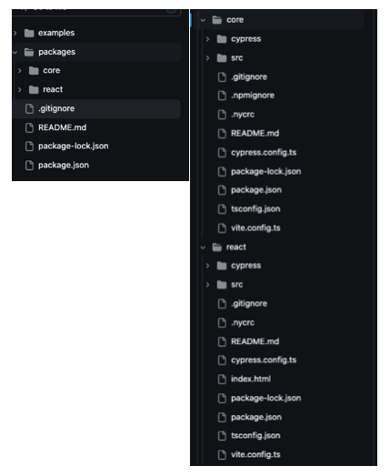
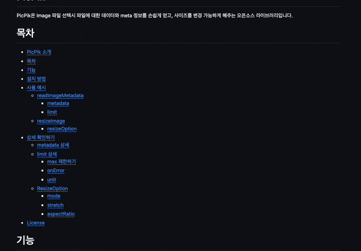
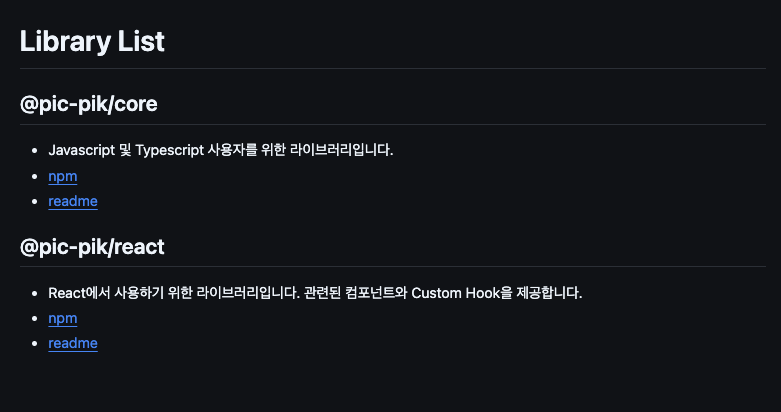
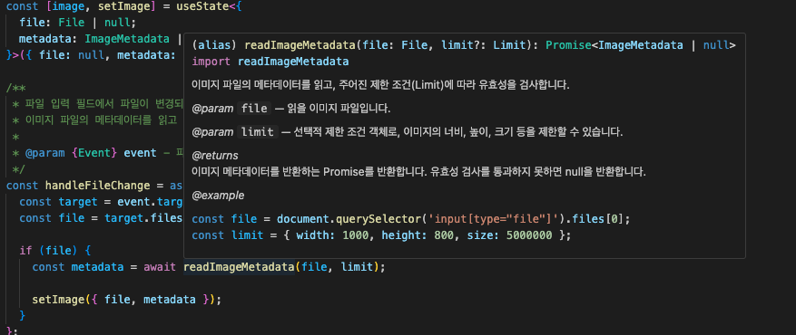
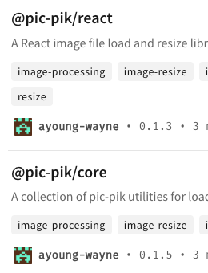

<span style="color:rgba(0,0,0,0)">오픈 소스 쉽지 않아....</span>

<!--more-->

<br/><br/><br/>

# 오픈 소스, 친절함을... 곁들인...

오픈 소스는 회사에서, 혹은 개인 프로젝트를 할 때보다 더 많이 신경 써야 하고, 더 친절해야 하는 것 같다.  
물론 코드를 작성할 때는 누가 보더라도 가독성 있는 코드를 작성해야 하지만, 오픈 소스는 그것보다 더 친절해야 하는 것 같다.  
(회사에서는 물어보면 바로 대답이라도 해줄 수 있으니...)  
나도 처음 배포해보는 프로젝트인 만큼, 여러모로 좋은 프로젝트가 되고자 여러 친절한(?) 요소를 추가하기로 했다.

## 친절 포인트 1. JS, React

같이 IC에서 참여하는 분들 프로젝트를 둘러보다가, React와 JS를 둘 다 지원하는 오픈 소스 라이브러리를 만드신 분을 보았다.

**"아니... 이거 너무 멋지잖아?"**

나도 기왕 OSS를 하는 김에, JS와 React 둘 다 사용할 수 있는 라이브러리를 배포하고 싶었다. 😣

일단 나는 React에서 사용할 수 있는 이미지 로드 및 리사이즈 라이브러리를 만들었다.  
컴포넌트와 개별 훅을 제공해서 사용자가 편한 방식으로 컴포넌트 자체를 불러와서 쓰든지, 본인의 컴포넌트에 `hook`을 사용해서 사용하는 방식을 제공했다.  
`hook`은 파일 `load`와 관련된 것과, 리사이즈에 관한 훅 2가지가 있었는데, 각 훅에는 당연히 JavaScript로 작성된 메인 로직이 있었다.  
나도 이 메인 로직을 분리해서 JS와 React 두 곳에서 사용할 수 있는 라이브러리를 배포하고 싶었다.

Core와 React를 한 레포 안에서 만들고, React 라이브러리를 Core를 기반으로 해서 만드는 방식으로 진행해 각각 배포해야겠다고 생각했다.  
참고로 이렇게 한 레포에서 여러 패키지를 관리하는 방식을 **`MonoRepo`** 방식이라고 한다고 한다!

지금까지 개발자로서 JS와 React를 둘 다 지원하는 라이브러리를 많이 봐왔는데, 파일 구조가 어떻게 되는 건지, 레포가 두 개인지 궁금했지만 파악해 본 적이 없었다.  
이번 프로젝트가 재미있는 경험의 기회가 되었다.

  
일단 프로젝트를 위 사진과 같이, `packages` 안에 `react`, `core` 두 폴더로 나누고 로직을 분리하기 시작했다.  
다만 각각의 프로젝트를 배포할 것이므로 해당 폴더마다 `package.json`이나 README를 각각 추가적으로 작성했다.

메인 로직을 Core로 코드를 분리하고, React 쪽에서 해당 Core의 코드를 `import`하는 방식으로 변경했다.

```typescript
import { useEffect, useMemo, useState } from "react";
import {
  type ResizeOption,
  type ImageMetadata,
  resizeImage,
  readImageMetadata,
} from "@pic-pik/core"; // core에서 메인 로직을 불러옴

interface Props {
  metadata?: ImageMetadata | null;
  option: ResizeOption;
}

const useResizeImage = ({ metadata, option }: Props) => {
  //...일부 로직 생략

  const handleResizeImage = async (
    metadata: ImageMetadata,
    option: ResizeOption
  ) => {
    try {
      const resizedFile = await resizeImage(metadata, option);
      if (resizedFile) {
        const resizedMetadata = await readImageMetadata(resizedFile);
        if (resizedMetadata)
          setResizedImage({ file: resizedFile, metadata: resizedMetadata });
      }
    } catch (error) {
      console.error("Error resizing image:", error);
    }
  };

  useEffect(() => {
    if (metadata) handleResizeImage(metadata, memoizedOption);
  }, [metadata, memoizedOption]);

  return resizedImage;
};

export default useResizeImage;
```

아직 Core의 패키지를 배포하지 않은 상태였지만, `npm link`의 사용법을 이미 알고 있었기 때문에, `link`로 연결해서 Core의 메인 로직을 패키지에서 불러오는 것처럼 작성할 수 있었다.

---

## 친절 포인트 2. 더 상세한 README

JS와 React로 분리된 만큼, README 업데이트가 당연히 필요했다.  
React용은 기존 README에서 일부 수정하여 반영할 수 있었으나, JS용 README에는 메인 함수를 분리한 만큼 해당 함수에 대한 설명을 새로 작성해야 했다. 😅



이렇게 각각의 README를 분리하고 난 뒤, 레포지토리의 README에 각각 분리된 README를 링크했다.



---

## 친절 포인트 3. JS Docs

유명한 라이브러리들을 사용하다 보면, 함수 등에 마우스를 호버하면 설명이 나올 때가 있다.  
그런 것을 가능하게 하는 것이 **JS Docs**인데, 나도 존재는 알고 있었고, 내 코드를 읽을 누군가를 위해 필요하다고 생각했지만, 스타트업의 바쁜 실무 환경 속에서 JS Docs를 작성해볼 기회가 많지 않았다. 😥  
(오히려 생각해보니, 나는 프론트 코드보다 백엔드 코드에 더 많이 작성했었다. 왜 그랬을까...)

```
JS Docs(JavaScript Documentation)는
JavaScript 코드의 동작, 구조, 사용 방법 등을 설명하는 문서를 의미합니다.
이 문서는 코드의 가독성과 유지보수성을 높이고,
다른 개발자나 미래의 자신이 코드를 이해하는 데 도움을 주기 위해 작성됩니다.

///example
/**
 * Calculates the sum of two numbers.
 *
 * @param {number} a - The first number.
 * @param {number} b - The second number.
 * @returns {number} The sum of the two numbers.
 */
function add(a, b) {
  return a + b;
}
```

오픈 소스 라이브러리는 불특정 다수가 사용하는 것이므로, 함수에 넘겨주는 파라미터가 어떤 역할을 하는지 명확하게 알 수 있어야 한다.  
코드의 가독성과 명시성을 위해 모든 함수(메인 로직, `hook`, `component`를 포함)에 JS Docs를 추가했다.

```typescript
import { validateImageFile, type Limit } from "./validateImageFile";

/**
 * @interface ImageMetadata
 * 이미지 파일의 메타데이터를 나타냅니다.
 * @property {number} height - 이미지의 높이 (픽셀 단위).
 * @property {number} width - 이미지의 너비 (픽셀 단위).
 * @property {number} size - 이미지 파일의 크기 (바이트 단위).
 * @property {string} name - 이미지 파일의 이름.
 * @property {string} extension - 이미지 파일의 확장자.
 * @property {string} src - 이미지 파일의 데이터 URL.
 */
export interface ImageMetadata {
  height: number;
  width: number;
  size: number;
  name: string;
  extension: string;
  src: string;
}

/**
 * 이미지 파일의 메타데이터를 읽고, 주어진 제한 조건(Limit)에 따라 유효성을 검사합니다.
 *
 * @param {File} file - 읽을 이미지 파일입니다.
 * @param {Limit} [limit] - 선택적 제한 조건 객체로, 이미지의 너비, 높이, 크기 등을 제한할 수 있습니다.
 *
 * @returns {Promise<ImageMetadata | null>} 이미지 메타데이터를 반환하는 Promise를 반환합니다.
 * 유효성 검사를 통과하지 못하면 null을 반환합니다.
 *
 * @example
 * const file = document.querySelector('input[type="file"]').files[0];
 * const limit = { width: 1000, height: 800, size: 5000000 };
 *
 * readImageMetadata(file, limit)
 *   .then(metaData => {
 *     if (metaData) {
 *       console.log('Image metadata:', metaData);
 *     } else {
 *       console.log('Image did not meet the validation criteria.');
 *     }
 *   });
 */
export const readImageMetadata = (
  file: File,
  limit?: Limit
): Promise<ImageMetadata | null> => {
  return new Promise((resolve) => {
    //...로직 생략
  });
};
```

위 JS Docs는 극히 일부이지만, 정말 한땀 한땀 정성껏 작성했다.
다만, 시간이 한정적인 직장인으로서 2주라는 짧은 시간 동안 모든 작업을 처리해야 했기에, JS Docs 작성에는 나의 영원한 동반자 ChatGPT의 도움을 받았다.
확실히 내가 쓴 JS Docs보다 더 깔끔하고 명료하게 작성해줘서 큰 도움이 되었다. 🤣

완성하고 나니 아래와 같이 표시된다!



사실 작성하고 나서 보니, 영어로 작성할걸 그랬나? 하는 생각이 들기도 했지만, 점진적으로 발전시키기로 하고 이 부분은 나중으로 넘기기로 했다.

## 이제 배포하자!

NPM에 패키지를 배포할 때가 왔다. 배포 방법에 대한 블로그 글은 많으니 상세 설명은 생략하고,
나는 JS, React용 두 가지를 모노레포를 활용해 만들었기 때문에, ~/core, ~/react로 각각 나누어 배포를 진행했다.
한 프로젝트임을 명시하기 위해 스코프 패키지를 사용하기로 했다.

```md
스코프 패키지란?
NPM에서 패키지 이름이 @스코프/패키지명 형식으로 되어 있는 경우,
해당 패키지는 스코프(namespace) 아래에 속하게 됩니다.

스코프 이름: @pic-pik
패키지 이름: core, react
```

이렇게 @pic-pik을 이용해서 한 프로젝트로 묶어서 배포를 진행했다.


## 후기

사실 발전시켜야 할 점은 수도 없이 많고, 부족한 점도 많다는 것을 알고 있다.
하지만 직장인 개발자가 2주라는 짧은 시간 속에, 평일 저녁과 주말 시간을 쪼개어 개발하고 찾아보고 공부해가며 문제를 하나씩 해결해 나가고,
사람들이 이용하든, 이용하지 않든 항상 오픈 소스를 소비하기만 하던 내가 이렇게 오픈 소스 생태계에 기여(?)해본 것은 정말 큰 경험이었다.

항상 궁금했지만 선뜻 시도해볼 생각을 하지 못했던 오픈 소스 개발을 IC에 참여하면서 경험할 수 있었고, 많은 것을 배울 수 있는 기회였다.
게다가 내가 실제로 평소 자주 사용하는 코드를 오픈 소스로 만든 것이기에, 앞으로도 해당 패키지를 사용하며 사용자로서 불편한 점을 꾸준히 개선할 예정이다. 👏

ps. 아 그리고 영어로 변경해야지...ChatGPT와 함께🤖
