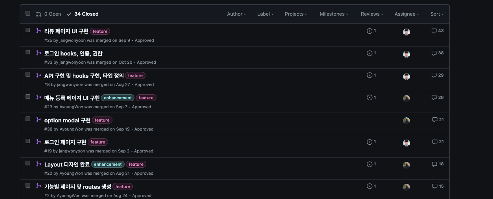

길고? 짧은 4개월의 과정 The End!

<!--more-->

   

# 끝났다!

길다면 길고, 짧다면 짧은 4개월의 과정이 끝이 났다.  
평일 3일에 3시간씩, 주말 9시간, 총 1주일에 18시간씩 4개월 동안 진행된 Inner Circle 과정이었다.  
중간중간 멘탈이 흔들릴 때도 있었지만, 무사히 수료하게 되었고, 그 후기를 작성해보고자 한다.
(사실 전반적인 후기라기보단, IC 과정 중 일부인 팀프로젝트와 IC 수료 후기라고 봐야겠다.)

## 팀 프로젝트 시작

3번의 개인 프로젝트가 끝난 후, 조별 프로젝트가 진행되었다.  
총 주제는 3가지였고, 6개의 조가 편성되어 각 주제당 2개 조가 프로덕트와 어드민을 맡는 구조였다.

### 생각보다 쉽지 않은데?

사실 쉽지 않을 것이라는 건 알고 있었다. 다만, **생각보다 더 어렵다는 점이 문제였다.**  
사람이라는 게, 처음에는 의지가 하늘을 뚫고 우주를 넘어갈 만큼 강력하지만, 시간이 지날수록 그 의지를 유지하는 것이 쉽지 않다.

특히 재직자 과정이다 보니, 다들 직장을 병행하면서 1주일에 고정적으로 18시간을 할애하는 것은 정말 어려운 일이었을 것이다.  
게다가 팀 프로젝트가 진행되면서 필수 참여 시간 외에도 프로젝트를 완수하기 위해 더 많은 시간을 투자해야 했다.

우리 조는 큰 문제가 없었지만, 다른 조에서는 중도 포기자가 대거 발생해 조를 병합하기도 했다.

### 기획과 디자인까지...?

많은 분들이 중도 포기한 이유 중 하나는, 팀 프로젝트가 시작되면서 주제와 태스크만 받았을 뿐,
디자인이나 기획은 제공되지 않았던 점 때문이었다. 개발만 열심히 하고 개발에 대해 배우는 과정일 줄 알았던 사람들이 기획과 디자인을 해야 한다는 점에서 적잖은 충격을 받았던 것 같다.

다행히 우리 조는 불만을 품고 떠난 사람은 없었다. 다들 브레인스토밍을 시작으로 차근차근 기획을 진행했고,  
나는 피그마의 에셋을 구매해 부족하지만 기본적인 디자인을 구성했다. 어려운 부분은 디자이너 지인에게 부탁해 몇 페이지를 완성했다. 😅 (고마워요, 코코!)

### 사실 그렇게 재미있는 주제는 아니야...

우리 조는 O2O 배달 서비스의 어드민을 맡았는데, 놀랍게도 조원 6명 중 **O2O 주제를 선택한 사람은 아무도 없었다.** 😂  
(나중에 알고 적잖이 충격...ㅋㅋㅋㅋㅋㅋㅋ)

조원들 대부분이 3~4년 차 개발자였기 때문에, 해당 기능을 구현하는 데 큰 어려움이 없었서, 도전 의식이 생기지 않아 흥미를 잃을 뻔 했다 ㅎ...
그래서 프론트엔드 팀원 3명(나 포함)은 **"회사에서는 하지 못했던 것들을 이곳에서 해보자"**라는 목표를 세우고 프로젝트에 임했다.

### 완성이 중요한가?

처음에 프로젝트를 한다고하면, 무조건 완성도 있는 프로젝트는 끝까지 완료해야 한다고 생각했는데,
곰곰히 생각해보니 우리가 이 프로젝트를 해서 실제 서비스를 것도 아니고, 지금까지 해보지 못한 것들을 해보고 배우려고
이곳에 모이게 되었는데, 프로젝트의 완성이 우리에게 딱히 중요한 일이 아니란 것을 깨달았다.

원래의 나라면, 팀원이 개인 사정으로 참여가 어려운 경우, 스트레스를 받고는 했는데, 프로젝트의 완성이 목표가 아니게 되다보니
그런 부분에 대해서 전혀 스트레스를 받지 않게 되었다ㅋㅋㅋㅋㅋ(다들 재직자라 야근이 필수불가결🥲...)

우리는 빠른 속도로 개발 진도를 나가지는 못했지만, 서로 고민하고 있던 부분, 하고 싶었던 것들을 얘기하며 천천히 개발을 진행해 나갔다.
사실 이러한 시간들이 나에게 큰 배움과 깨달음을 준 기간이었다고 생각한다.

## 회사에서 하지 못한 한을 풀어보자

### 코드 리뷰

다들 스타트업 규모의 회사에서 명확한 피드백이나 코드 리뷰 없이 개발해온 터라, 이 부분에 대한 갈증이 있었다.  
그래서 서비스 주제는 우리에게 큰 도전을 주지 않았지만, 꼼꼼한 코드 리뷰를 하기로 정하고 서로 열심히 리뷰에 임했다.

  

프론트엔드 팀원들은 사실 개발보다 코드 리뷰에 더 많은 시간을 할애한 게 아닌가 싶을 정도로 열심히 했다.  
얼마나 회사에서 제대로 된 코드 리뷰를 받고 싶었는지 그 열정이 느껴질 정도였다.

### 테스트 코드

회사에서는 일정이 촉박하고 인원이 부족한 탓에 테스트 코드를 작성하지 못하고 넘어가는 일이 많았다.  
그래서 이번에는 꼼꼼한 테스트 코드 작성을 목표로 삼았다.

현업에서 Cypress 정도만 사용했었는데, 이번 프로젝트를 통해 React Testing Library와 MSW를 새롭게 알게 되었다.  
특히 MSW는 테스트뿐 아니라 실무에서도 백엔드 개발 전에 활용해 프론트 개발에 큰 도움이 될 것 같았다.  
회사 밖에서 다양한 툴과 지식을 접할 수 있다는 점이 참 신선하게 느껴졌다.

### 파일 구조

React의 파일 구조는 자유도가 높은 만큼, 항상 최선의 파일 구조란 무엇일까 고민이 많았다.
page, components, query, model, hook 등...
무조건 옳은 구조란 것은 없겠지만, 팀원분들과 멘토님들과 이야기를 나누며 내가 생각하는 좋은 구조를 정립한 것 같다.
이것은 다음에 다른 포스트에 글을 남기도록 하겠다. (이걸로 중간 발표에서 발표도 했다!)

## 발표

(조장: 아영) 이건 내가 쓴게 아니다 ㅋㅋㅋㅋㅋㅋㅋㅋ어느날 들어와보니 누가 써놓음...

우리 팀은 팀장이 따로 없었다(서로 팀장 같은 마음으로 열심히 하자라는 의미였을뿐).
하지만, 내가 원래 워낙 J이기도 하고, 계획이나 명확한 정리 없이 일하는 것을 좋아하지 않기 때문에, 그런 부분에 대해서 나서다보니
조에서는 자연스럽게 (가짜)조장 같은 분위가 되어서, 프로젝트 중간 발표에서는 내가 발표를 하겠다고 했다.

 
개발자가 되기 전, 경영학부 조별 과제와 경영지원팀에서 일한 경험 덕분에 PPT를 만들고 발표하는 것은 큰 어려움이 없었다.  
하지만 개발자가 된 이후 처음으로 이런 발표를 하다 보니, 나름 설레고 긴장되는 경험이었다.

## 프로젝트 끝내며

팀 프로젝트를 진행하며 이인제 멘토님께 멘토링도 받고, 다 함께 ZEP에서 모여 개발하며, 다양한 문제를 함께 해결했다.  
야근이나 직장인으로서의 현실적인 문제, 다른 조와의 협업 문제 등 쉽지 않은 순간도 많았지만,  
우리 조원 모두 유쾌하고 비슷한 고민을 가진 동료들 덕분에 많은 도움을 얻을 수 있었다.

Inner Circle에서 얻은 것 중 가장 뿌듯했던 점은 **멋진 조원들과 개발자로서 연결될 수 있었다는 것**이다. 😎
중반에는 팀프로젝트가 원활히 진행되지 않아서, '아 역시 재직자들이 모여서 이상적인 팀프로젝트를 하기에는 무리인 것인가'
라고 생각하고는 했지만 프로젝트를 끝나고 나니, 배운 점도 많았고 훌륭하신 개발자들을 많이 만나게 된 것이 무엇보다 큰 행운이었던 것 같다.

## 마무리

중간중간 고비도 있었지만, 무사히 수료했다는 점만으로도 스스로가 기특하다고 생각한다.  
실제로 중도 포기한 분들이 절반 정도는 되지 않을까 싶은데...(일일이 세어보진 않았지만!)  
그만큼 끝까지 남은 분들은 열정적으로 참여한 사람들이라고 생각한다.

앞으로 Inner Circle이 계속될 것으로 알고 있는데,  
**"추천하냐"**고 묻는다면,  
**"해볼 만하지만, 팀 프로젝트 위주 진행이 싫은 분들은 고민해보라"** 정도이다.

특히 기획과 디자인이 제공되지 않아 자율성이 큰 부분에서 많은 분들이 우왕좌왕한 것 같다.  
다만, 이 부분은 1기였기 때문에 발생한 문제일 수도 있고, 이후 더 나아질 가능성이 높으니 참고만 하길 바란다.

패스트캠퍼스 매니저님들은 열심히 도와주셨고, 태곤님, 태양님, 인제님에게 받은 멘토링도 매우 좋았다.  
특히 당시 개발자로서 많은 고민을 하고 있었고, 나만 이런 건가 싶었는데 팀원들과 얘기하면서 비슷한 고민을 공유하고 의지할 수 있었다.

또 재직자 전형 개발자 교육 프로그램이 많지 않은 만큼, 이런 과정이 앞으로 더 많이 생기길 바란다!

**PS.** 이제 다음에는 어떤 것에 참여해볼지 하이에나처럼 찾아다니는 중... 🐕
